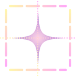

# Screenshot to LLM Context

  

A browser extension that converts screenshots into optimized text descriptions for LLM context. This tool helps save tokens when using premium AI models like Claude and ChatGPT by pre-processing visual information through Gemini.

  
  

## Features

- **Area Selection**: Capture specific portions of any webpage with an intuitive selection tool
- **Image Processing**: Automatically process screenshots through Google's Gemini API
- **Customizable Prompts**: Choose from different prompt templates to control how images are described
- **Copy to Clipboard**: Easily copy the generated descriptions to paste into your preferred LLM
- **Settings Management**: Configure your API key and customize prompt templates

## How It Works

1. Click the extension icon and select an area of the screen to capture
2. The extension processes the image through Gemini's vision capabilities
3. A detailed text description is generated that you can copy and use as context in other LLMs
4. Save tokens in your premium LLM conversations by using pre-processed visual information

## Benefits

- **Token Efficiency**: Reduce token usage in premium models by pre-processing images
- **Better Context**: Get detailed descriptions of visual content for your AI conversations
- **Seamless Workflow**: Quickly capture and process visual information without leaving your browser

## Setup

1. Currently only supports Google Chrome
2. Download this repository from https://github.com/szeyu/Screenshot2LLMContext
3. Open Chrome and navigate to `chrome://extensions/`
4. Enable "Developer mode" in the top-right corner
5. Click "Load unpacked" and select the downloaded repository folder
6. Get your Gemini API key from [Google AI Studio](https://aistudio.google.com/)
7. Add your Gemini API key in the extension settings page
8. Start capturing screenshots and generating optimized LLM context

  <h3 align="center">Created by Sim Sze Yu</h3>
  

    Bachelor of Computer Science (Artificial Intelligence) 
    Universiti Malaya
  

  

    
  

  

    ⭐️ <strong>Don't forget to star this repository if you find it helpful!</strong> ⭐️
  

